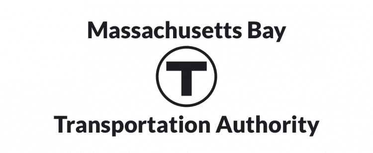

[![Contributors][contributors-shield]][contributors-url]
[![MIT License][license-shield]][license-url]
[![LinkedIn][linkedin-shield]][linkedin-url]

<br />
<div align="center", style="background-color:#33475b">
  <a href="https://github.com/THWiseman/TrainTracker">
      
    </a>
    <a href="https://github.com/THWiseman/TrainTracker">
      
    </a>
</div>

## Train Tracker
This is a console Python application that uses the MBTA API to answer a few questions about Subway travel in Boston.

## Getting Started
To run this program, you will need git, Python 3.7+, and the latest version of pip (Python Package Installer) installed on your local machine and terminal. All are available through homebrew, although I recommend consulting an OS specific guide for installing them if this is your first time. Once those are installed:

1. Clone this repo to a local directory
```sh
git clone https://github.com/THWiseman/TrainTracker.git
```

2. Navigate to the root folder of the project
```sh
cd TrainTracker
```

3. Install the project dependencies using pip. 
```sh
pip install -r /TrainTracker/requirements.txt
```

4. Run the project
```sh
python  /TrainTracker/main.py
```
*Note: your local machine may require that you use the commands `pip3` or `python3` instead of `pip` and `python` 

## Usage


[contributors-shield]: https://img.shields.io/github/contributors/THWiseman/TrainTracker.svg?style=for-the-badge
[contributors-url]: https://github.com/THWiseman/TrainTracker/graphs/contributors
[license-shield]: https://img.shields.io/github/license/THWiseman/TrainTracker.svg?style=for-the-badge
[license-url]: https://github.com/THWiseman/TrainTracker/blob/main/LICENSE.txt
[linkedin-shield]: https://img.shields.io/badge/-LinkedIn-black.svg?style=for-the-badge&logo=linkedin&colorB=555
[linkedin-url]: https://linkedin.com/in/thwiseman
